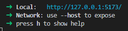

# TaskLeap

URL > https://taskleap.netlify.app/

[](https://app.netlify.com/sites/taskleap/deploys)

**TaskLeap** - is based on task-list(todo-list).

## Techologies used :


# Start Using:

1. Clone Git repository

`git clone https://github.com/NemoX12/NemoX12.git`

2. Setup enviroment

```
$./todo-list> npm install
$./todo-list> npm run dev
```

3. Follow local link in console pop-up



You are ready to go.

## How to end session

> Ctrl + C in terminal (Win)

> Cmd + C in terminal (Mac)

# License

### MIT
